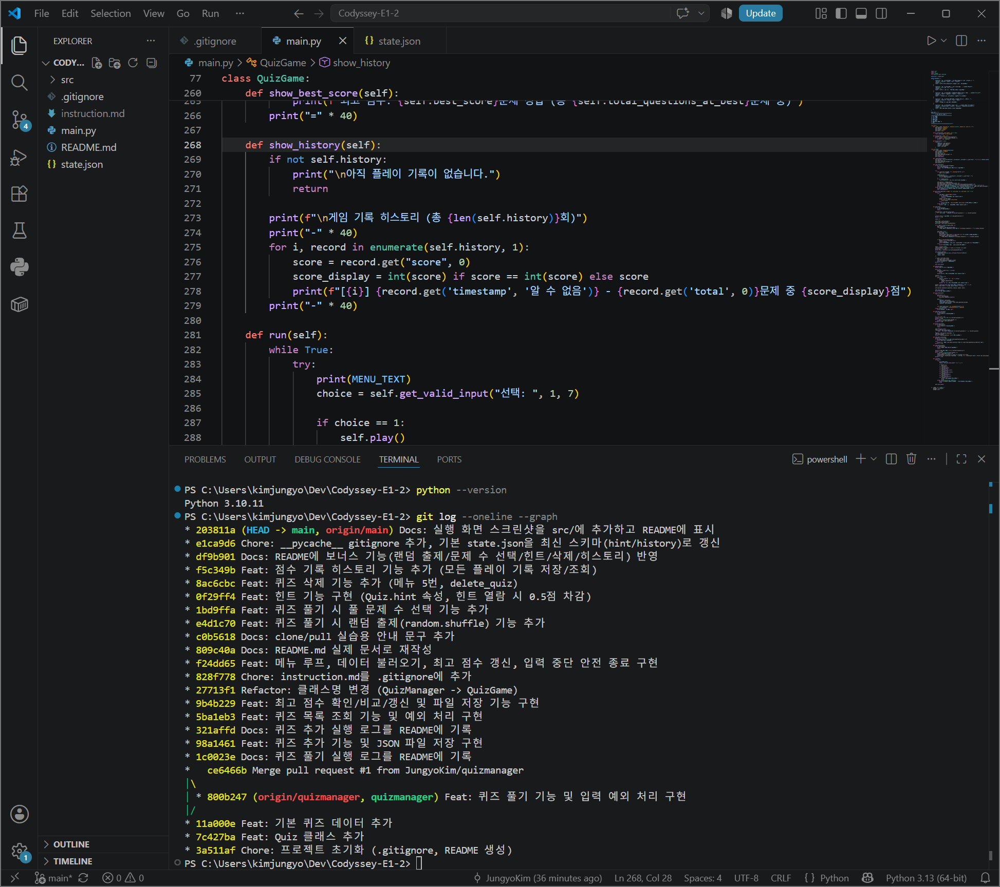
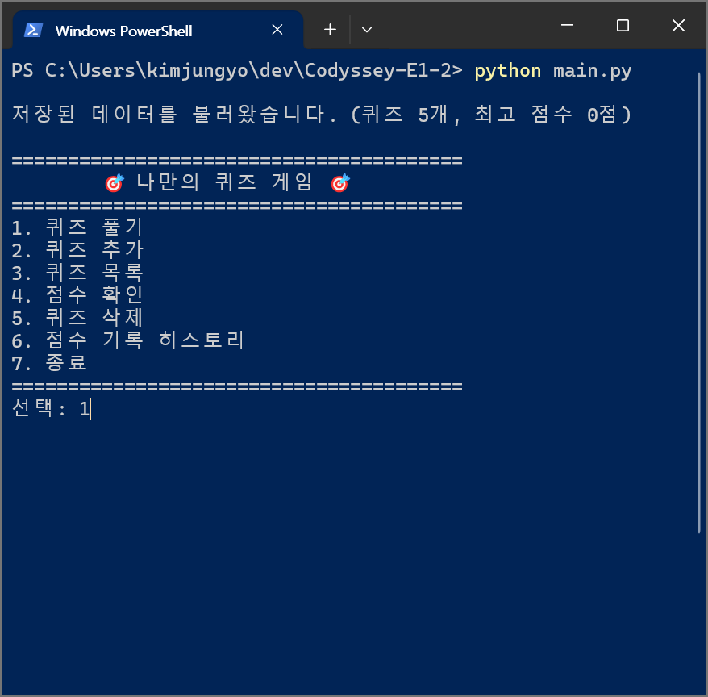
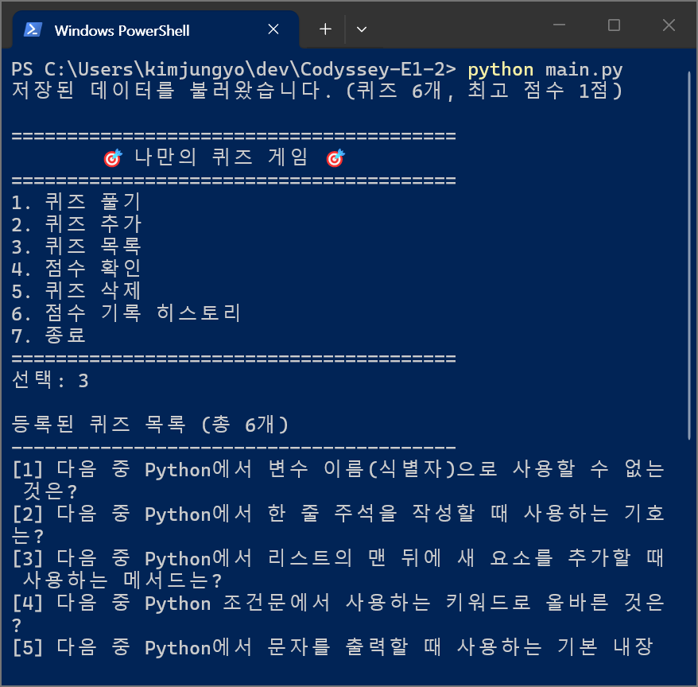
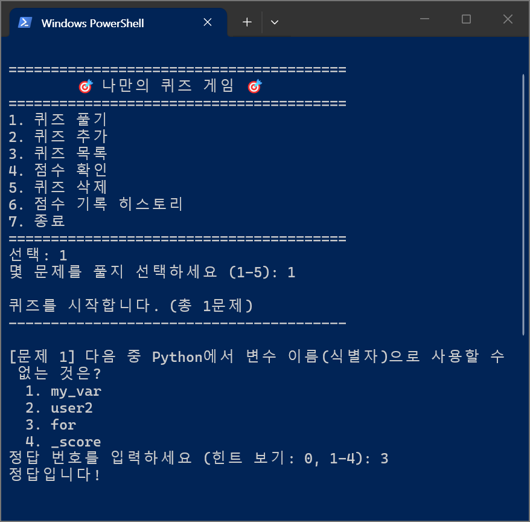
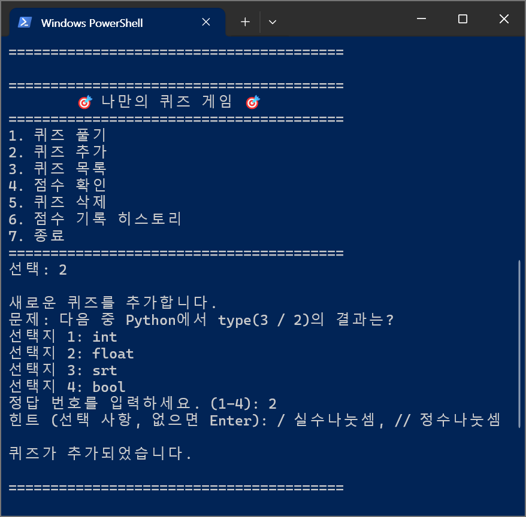
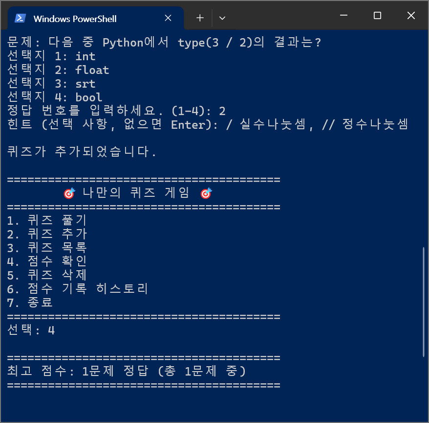
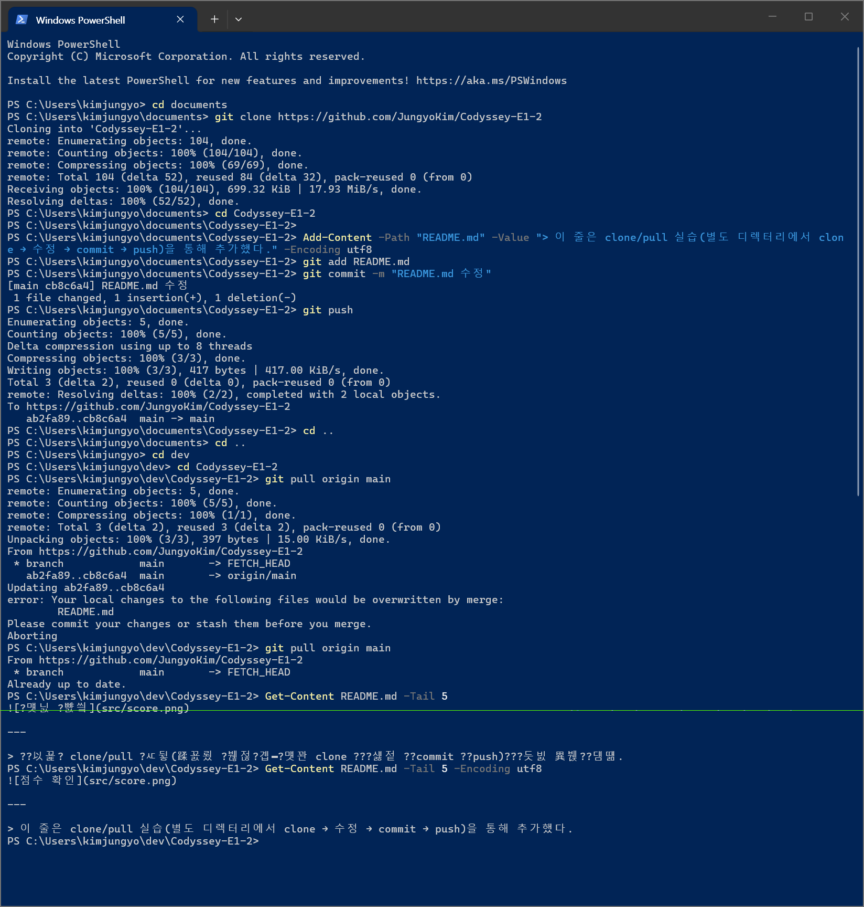

# E1-2

## 프로젝트 개요

- Python 기본 문법(변수, 조건문, 반복문, 함수)과 클래스(객체 지향), JSON 파일 입출력, Git 워크플로우를 동시에 익히기 위한 학습용 프로젝트이다.
- `Quiz`(퀴즈 1개를 표현) / `QuizGame`(게임 전체 진행·저장을 관리) 두 클래스로 역할을 분리했다.
- 잘못된 입력(빈 값, 숫자 아님, 범위 밖), `Ctrl+C`/입력 스트림 종료(EOF), 저장 파일 손상까지 예외 처리를 통해 비정상 종료 없이 동작히도록 구현했다.

## 퀴즈 주제와 선정 이유

주제는 **Python 기초 문법**이다. 이 과제 자체가 Python 문법을 배우는 과정이기 때문에, 이 프로젝트에서 다룬 내용을 퀴즈로 만들면 학습 효과가 클것이라고 판단해 선택했다.

## 실행 방법

```bash
python main.py
```

- Python 3.10 이상.
- 실행하면 프로젝트 루트의 `state.json`을 읽어 이전에 저장된 퀴즈/최고 점수를 불러온다.
파일이 없으면 변수로 지정된 기본 퀴즈 5개로 시작한다.
- 메뉴에서 숫자를 입력해 기능을 선택할 수 있다.

```
========================================
        🎯 나만의 퀴즈 게임 🎯
========================================
1. 퀴즈 풀기
2. 퀴즈 추가
3. 퀴즈 목록
4. 점수 확인
5. 퀴즈 삭제
6. 점수 기록 히스토리
7. 종료
========================================
선택:
```

## 기능 목록

1. **퀴즈 풀기** — 풀 문제 수를 먼저 선택한 뒤, 그 수만큼 퀴즈를 무작위 순서(`random.shuffle`)로 출제한다. 각 문제에서 `0`을 입력하면 힌트를 보고(정답 시 0.5점 차감) 다시 답을 입력할 수 있다. 정답/오답을 즉시 알려주고 최종 결과를 표시하며, 매 플레이 기록을 히스토리에 남기고 이번 점수가 기존 최고 점수보다 높으면 최고 점수를 갱신한다. 데이터는 모두 `state.json`에 저장된다.
2. **퀴즈 추가** — 문제, 선택지 4개, 정답 번호(1~4), 힌트(선택 사항)를 입력받아 새 퀴즈를 등록하고 즉시 `state.json`에 저장한다.
3. **퀴즈 목록** — 등록된 퀴즈의 문제 목록을 번호와 함께 보여준다.
4. **점수 확인** — 저장된 최고 점수(및 채점 기준이 된 총 문제 수)를 보여준다. 아직 기록이 없으면 안내 메시지를 출력한다.
5. **퀴즈 삭제** — 목록에서 번호를 선택해 퀴즈를 삭제하고 즉시 `state.json`에 반영한다.
6. **점수 기록 히스토리** — 지금까지 플레이한 모든 게임의 날짜/시간, 문제 수, 획득 점수를 순서대로 보여준다.
7. **종료** — 프로그램을 저장 후 안전하게 종료한다.

공통 처리:
- 숫자 입력이 필요한 모든 곳에서 앞뒤 공백 제거, 빈 입력, 숫자 변환 실패, 허용 범위 밖 입력을 감지해 안내 메시지를 출력하고 재입력을 받습니다(`QuizGame.get_valid_input`).
- 실행 중 `Ctrl+C`(KeyboardInterrupt)나 입력 스트림 종료(EOFError)가 발생해도 예외를 그대로 노출하지 않고, 안내 메시지를 출력한 뒤 지금까지의 데이터를 저장하고 안전하게 종료한다.
- `state.json`이 없거나(첫 실행) 손상된 경우(JSON 파싱 실패, 필수 키 누락 등) 기본 퀴즈 데이터로 자동 복구한다.

## 파일 구조

```
Codyssey-E1-2/
├── main.py       # Quiz, QuizGame 클래스와 실행 진입점(main)
├── state.json    # 퀴즈 목록, 최고 점수, 게임 기록을 저장하는 데이터 파일 (UTF-8)
├── README.md     # 프로젝트 설명 문서
├── .gitignore
└── src/          # 개발 환경·실행 화면 스크린샷
    ├── env.png
    ├── menu.png
    ├── list.png
    ├── play.png
    ├── add_quiz.png
    └── score.png
```

`main.py` 내부 구조:
- `Quiz`: 퀴즈 1개(문제, 선택지, 정답, 힌트)를 표현. 정답 확인(`is_correct`), 출력(`display`), 직렬화(`to_dict`) 담당.
- `QuizGame`: 게임 전체 진행을 담당. 퀴즈 목록/최고 점수/게임 기록 보관, 메뉴 루프(`run`), 퀴즈 풀기(`play`)/추가(`add_quiz`)/목록(`show_quiz_list`)/삭제(`delete_quiz`)/점수 확인(`show_best_score`)/기록 조회(`show_history`), 파일 저장(`save_state`)/불러오기(`load_state`)를 메서드로 분리.

## 데이터 파일 설명 (`state.json`)

- 위치: 프로젝트 루트(`main.py`와 같은 경로), 인코딩: UTF-8.
- 프로그램 시작 시 `QuizGame.load_state()`가 읽고, 퀴즈 추가 직후·최고 점수 갱신 직후·프로그램 종료 시 `QuizGame.save_state()`가 쓰기를 진행함.
- 스키마:

```json
{
    "quizzes": [
        {
            "question": "다음 중 Python에서 변수 이름(식별자)으로 사용할 수 없는 것은?",
            "choices": ["my_var", "user2", "for", "_score"],
            "answer": 3,
            "hint": "파이썬 예약어(keyword)는 식별자로 사용할 수 없습니다."
        }
    ],
    "best_score": 4.5,
    "total_questions_at_best": 5,
    "history": [
        {"timestamp": "2026-08-06 10:04:11", "total": 5, "score": 4.5}
    ]
}
```

| 필드 | 타입 | 설명 |
|---|---|---|
| `quizzes` | list | 등록된 퀴즈 목록 |
| `quizzes[].question` | str | 문제 텍스트 |
| `quizzes[].choices` | list[str] | 선택지 4개 |
| `quizzes[].answer` | int | 정답 번호(1~4) |
| `quizzes[].hint` | str | 힌트 텍스트(없으면 빈 문자열) |
| `best_score` | float | 최고 점수. 힌트를 사용하면 0.5점 단위라 항상 float으로 저장됨 |
| `total_questions_at_best` | int | 최고 점수를 기록했을 당시의 전체 문제 수 |
| `history` | list | 플레이할 때마다 추가되는 게임 기록 |
| `history[].timestamp` | str | 플레이 일시(`YYYY-MM-DD HH:MM:SS`) |
| `history[].total` | int | 그 게임에서 푼 문제 수 |
| `history[].score` | float | 그 게임에서 획득한 점수 (항상 float) |

파일이 없으면 기본 퀴즈 5개로 시작하고, 파일 내용이 손상되었으면(JSON 파싱 실패, `quizzes` 키 누락 등) 안내 메시지를 출력한 뒤 기본 퀴즈 데이터로 초기화한다.

## 실행 화면 스크린샷

### 개발 환경 및 커밋 로그
Python/Git 버전, VSCode 개발 환경과 `git log --oneline --graph` 실행 결과를 함께 캡처했다.


### 메뉴 화면


### 퀴즈 목록


### 퀴즈 풀기


### 퀴즈 추가


### 점수 확인


---

## Git 저장소 복제 실습

> 이 줄은 clone/pull 실습(별도 디렉터리에서 clone → 수정 → commit → push)을 통해 추가했다.

